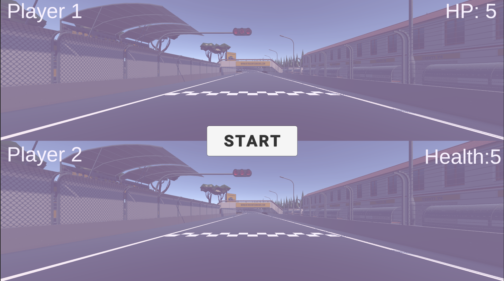
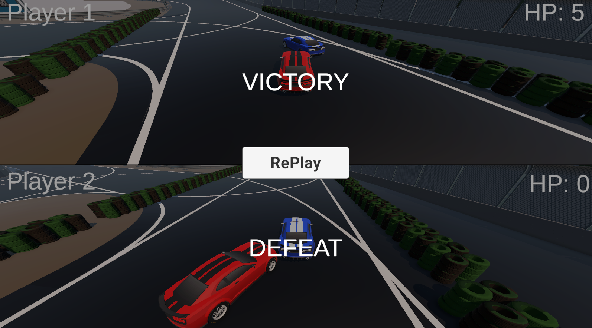
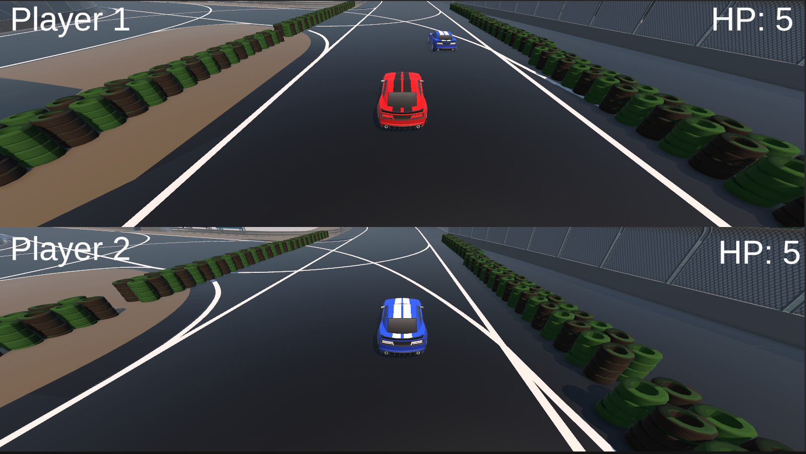

# Dodger Racing Game

## Overview

Dodger is a 3D racing game designed for two players to race against each other. The game includes a race track with a start and finish line, where each player controls a vehicle and competes for victory. Players must dodge each other and avoid hits, as five collisions with the other player's vehicle will result in a loss. If both players avoid collisions, the first player to cross the finish line wins the race.

## Features

1. **Multiplayer Split-Screen Racing:**
   - Two-player racing on a single screen.
   - **Player 1** uses WASD keys to control their vehicle.
   - **Player 2** uses the arrow keys to control their vehicle.

2. **Health Mechanism:**
   - Each player has a health of 5 hits.
   - Upon each collision between the two cars, the player with the lower speed loses 1 health point.
   - If a player reaches 0 health, they lose the game.

3. **Finish Line Victory:**
   - If no player loses health during the race, the first player to cross the finish line wins.

4. **Race Track:**
   - The game features a detailed race track with checkpoints and a clear start/finish line.

## Game Mechanics

### Movement & Controls

- **Player 1 Controls:**
  - Move Forward: `W`
  - Move Backward: `S`
  - Steer Left: `A`
  - Steer Right: `D`
  
- **Player 2 Controls:**
  - Move Forward: `↑`
  - Move Backward: `↓`
  - Steer Left: `←`
  - Steer Right: `→`

### Health System
- Each player starts with 5 health points.
- A player loses health if they collide with another player's car, and their vehicle has a lower speed than the opponent.
- The game manager (`GameManager`) tracks each player's health and updates the UI.
- Once a player's health reaches 0, the other player is declared the winner.

### Checkpoints & Finish Line
- The race includes checkpoints and a finish line.
- The game keeps track of checkpoint completions for each player.
- The first player to complete all checkpoints and cross the finish line wins the race, unless one player is eliminated due to health depletion.

## Code Structure

### `CarController.cs`
This script handles:
- Player controls and movement.
- Collision detection between vehicles.
- Wheel animations and effects.
- Health reduction logic when players collide.

### `GameManager.cs`
This script manages:
- Game state and victory conditions.
- Health UI for both players.
- Win and loss logic based on health or finish line completion.
- Scene reload functionality.

### `UI Components`
- The game features a simple UI that displays each player's health.
- Upon winning or losing, the respective messages ("VICTORY" or "DEFEAT") are displayed for each player.

## How to Play

1. **Set Up the Game:**
   - Start the game with two players.
   - Player 1 controls the car using WASD keys.
   - Player 2 controls the car using arrow keys.

2. **Objective:**
   - Either eliminate the other player by reducing their health to zero or reach the finish line first without getting eliminated.

3. **Winning the Game:**
   - The game will display the winner based on either health depletion or crossing the finish line.

## Additional Features
- **Collision Effects:**
  - Special effects and trails appear when the vehicles brake or collide.
- **Checkpoint System:**
  - Each player must pass through checkpoints during the race.
 
## Game Menu
Here is a screenshot of the game menu:

## Gameplay
Check out the gameplay screenshot:

